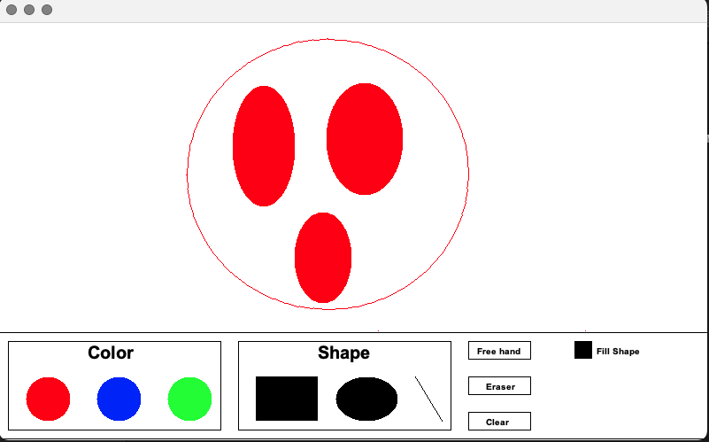

# Drawing Application

This is a simple drawing application built using Java and the AWT (Abstract Window Toolkit) library. The application allows users to draw various shapes such as lines, rectangles, ovals, and freehand drawings. It also includes an eraser tool to erase parts of the drawing. The user interface provides options to select different colors, shapes, and to toggle the fill property of shapes.

## Features

- **Shapes**: Draw lines, rectangles, ovals, and freehand drawings.
- **Eraser**: Erase parts of the drawing.
- **Color Selection**: Choose from a set of predefined colors (Red, Blue, Green).
- **Fill Toggle**: Toggle the fill property of shapes.
- **Clear Canvas**: Clear the entire drawing area.

## How to Use

1. **Select a Shape**: Click on the shape buttons (Rectangle, Oval, Line, FreeHand) to select the shape you want to draw.
2. **Select a Color**: Click on the color circles (Red, Blue, Green) to choose the drawing color.
3. **Toggle Fill**: Click on the "Fill Shape" button to toggle the fill property of shapes.
4. **Draw**: Click and drag on the canvas to draw the selected shape.
5. **Erase**: Select the eraser tool and click and drag to erase parts of the drawing.
6. **Clear Canvas**: Click on the "Clear" button to clear the entire drawing area.

## Future Implementations

The following features are planned for future versions of the application:

- **Dotted Checkbox**: If checked, it lets the shapes' line strokes be dotted. If not checked, it lets the shapes' line strokes be solid.
- **Undo Button**: It lets the user undo the previous action(s).
- **Save Button**: It enables the user to save their drawings to a file as an image.
- **Open Button**: It enables the user to load an image to the drawing area.

## Code Structure

The project consists of the following main classes:

- **Shape.java**: Abstract base class for all shapes.
- **Line.java**: Represents a line shape.
- **Rectangle.java**: Represents a rectangle shape.
- **Oval.java**: Represents an oval shape.
- **FreeHand.java**: Represents freehand drawing.
- **Eraser.java**: Represents the eraser tool.
- **Ui.java**: Handles the user interface and drawing controls.
- **Main.java**: The main class that initializes and runs the application.

## Running the Application

To run the application, compile and execute the `Main.java` file. Ensure that you have the necessary Java Development Kit (JDK) installed on your system.

```bash
javac Main.java
java Main
```
## Contributing

Contributions are welcome! If you have any suggestions or improvements, feel free to open an issue or submit a pull request.

## License

This project is licensed under the MIT License. See the LICENSE file for details.

Enjoy drawing! 🎨
